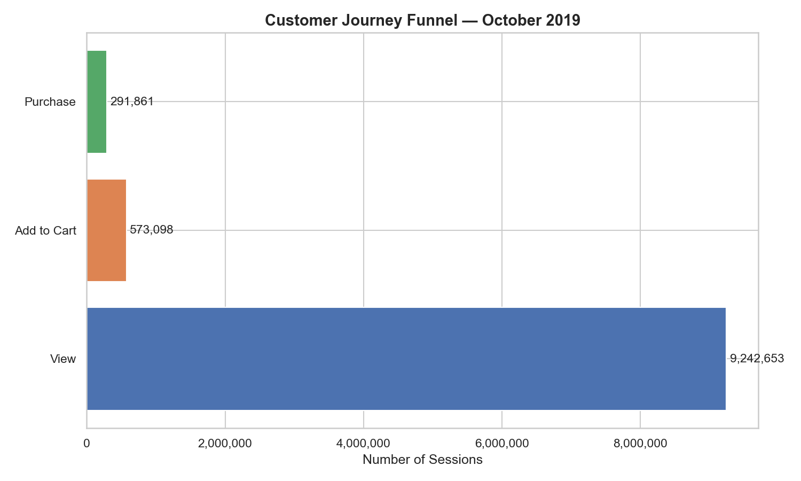
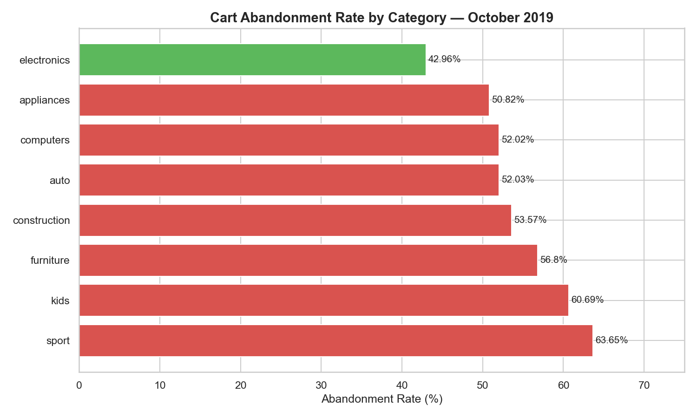

# 🛒 Reducing Cart Abandonment — End-to-End Project

> **49.07% of sessions that added a product to cart never completed a purchase — representing an estimated $134M in lost revenue in October 2019 alone.**

This project follows the full Business Analyst lifecycle to investigate, quantify, and propose solutions to cart abandonment at an undisclosed e-commerce platform, using real behavioural event data published via Kaggle by Open CDP.

---

## 📸 Dashboard Preview




---

## 🔑 Key Findings

- 🛒 **49.07% cart abandonment rate** — nearly 1 in 2 sessions that added to cart never purchased
- 💸 **$134M+ in estimated monthly revenue lost** across 573,098 abandoned sessions
- ⏱️ **90% of purchases happen within 7.4 minutes** of adding to cart — after that, intent drops sharply
- 🌏 **Abandonment is lowest at 5–9am UTC** — mapping to peak afternoon hours in China and India
- ❌ **Price is NOT the driver** — abandoned and purchased items have near-identical average prices
- 🍎 **Apple smartphones represent the single biggest revenue opportunity** — $1.95M lost from one product ID in one month
- 📧 **35.1% of abandoners self-recover** without any nudge — a recovery email sequence could push this to 45–50%

---

## 💡 Proposed Solutions & Projected ROI

| Initiative | Est. Monthly Revenue Recovered | Effort | Payback |
|---|---|---|---|
| 🛒 Guest Checkout | $6.7M–$16.1M | Low | Immediate |
| 📧 Cart Recovery Emails | $16.1M–$24.7M | Low | Immediate |
| ✨ Checkout UX Improvements | $4.0M–$6.7M | Medium | < 1 month |
| **Total** | **$26.8M–$47.5M/month** | | |

---

## 🗂️ Project Structure

```
cart-abandonment-analysis/
│
├── README.md
├── 1_problem_statement/
│   ├── problem_statement.md        ← Business problem, objectives, scope
│   └── stakeholder_analysis.md     ← Stakeholder register, RACI matrix
├── 2_process_mapping/
│   ├── as_is_process.png           ← Current checkout flow with pain points
│   ├── as_is_process.drawio        ← Editable source file
│   ├── to_be_process.png           ← Improved future-state checkout
│   └── to_be_process.drawio        ← Editable source file
├── 3_data_analysis/
│   ├── analysis.ipynb              ← Python analysis (Pandas, Matplotlib, Seaborn)
│   ├── sql_analysis.ipynb          ← SQL analysis (SQLite)
│   └── data/                       ← Dataset (not included — see below)
├── 4_requirements/
│   ├── BRD.md                      ← Business Requirements Document
│   ├── user_stories.md             ← 11 user stories with acceptance criteria
│   └── traceability_matrix.xlsx    ← Links stories → requirements → insights → KPIs
├── 5_dashboard/                    ← Charts and Power BI dashboard
└── 6_business_case/
    └── business_case.md            ← ROI projections and implementation roadmap
```

---

## 🔁 Project Phases

| Phase | Deliverable | Status |
|---|---|---|
| 1 — Define | Problem statement & stakeholder analysis | ✅ Complete |
| 2 — Process Mapping | AS-IS & TO-BE process maps (BPMN) | ✅ Complete |
| 3 — Data Analysis | Python + SQL analysis, 10 charts | ✅ Complete |
| 4 — Requirements | BRD, user stories, traceability matrix | ✅ Complete |
| 5 — Dashboard | Power BI dashboard | 🔄 In Progress |
| 6 — Business Case | ROI projections & recommendations | ✅ Complete |

---

## 📊 Analysis Highlights

### Funnel Drop-Off
| Stage | Sessions | % of Top |
|---|---|---|
| View | 9,242,653 | 100% |
| Add to Cart | 573,098 | 6.2% |
| Purchase | 291,861 | 3.2% |

### Abandonment by Category
| Category | Abandonment Rate |
|---|---|
| Sport | 63.65% |
| Kids | 60.69% |
| Furniture | 56.80% |
| Computers | 52.02% |
| Electronics | 42.96% |

### Abandonment by Day
| Day | Abandonment Rate |
|---|---|
| Friday | 51.12% |
| Tuesday | 50.34% |
| Wednesday | 46.88% |
| Thursday | 46.93% |

---

## 🗃️ Dataset

**Source:** [E-Commerce Behavior Data](https://www.kaggle.com/datasets/mkechinov/ecommerce-behavior-data-from-multi-category-store) by Open CDP via Kaggle  
**Period:** October 2019  
**Size:** 42M+ events  
**Events:** `view`, `cart`, `purchase`  
**Fields:** `event_time`, `event_type`, `product_id`, `category_code`, `brand`, `price`, `user_id`, `user_session`

> The dataset is not included in this repo due to file size. Download it from Kaggle and place it in `3_data_analysis/data/` to run the notebooks locally.

---

## 🛠️ Tools Used

| Tool | Purpose |
|---|---|
| Python (Pandas, Matplotlib, Seaborn) | Data cleaning, analysis, visualisation |
| SQL (SQLite) | Structured querying and deeper analysis |
| Draw.io | AS-IS and TO-BE process mapping |
| Power BI | KPI dashboard |
| Markdown | Documentation |
| Git / GitHub | Version control |

---

## 👤 Author

**Tiziano Gallo**
[GitHub](https://github.com/tizianogallo) · [LinkedIn](#)

---

*This project was completed as part of my portfolio. All analysis is based on publicly available data.*
